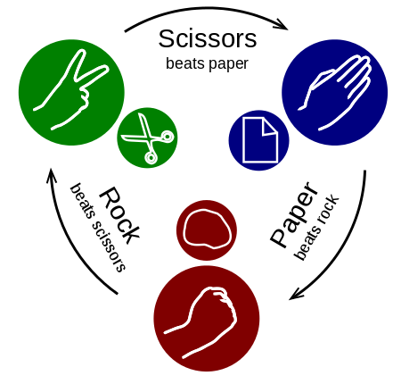

# Double Dispatch

## Problem Statement - Paper, Scissor, Rock

Two  players  choose  one   of  rock,  paper  and
scissors after  counting to three and  making one
of these gestures:

- A clenched fist representing a rock.

- A flat hand representing a piece of paper.

- Index  and middle finger  extended representing
  a pair of scissors
  
	
  
Image Source: [https://en.wikipedia.org/wiki/Rock-paper-scissors](https://en.wikipedia.org/wiki/Rock-paper-scissors)

## Rules
If they  choose the  same gesture,  neither wins;
if not, the result is decided this way:

- Rock  defeats  scissors, because  a  rock  will
  blunt a pair of scissors

- Paper  defeats rock,  because a paper  can wrap
  up a rock

- Scissors  defeat  paper, because  scissors  cut
  paper
